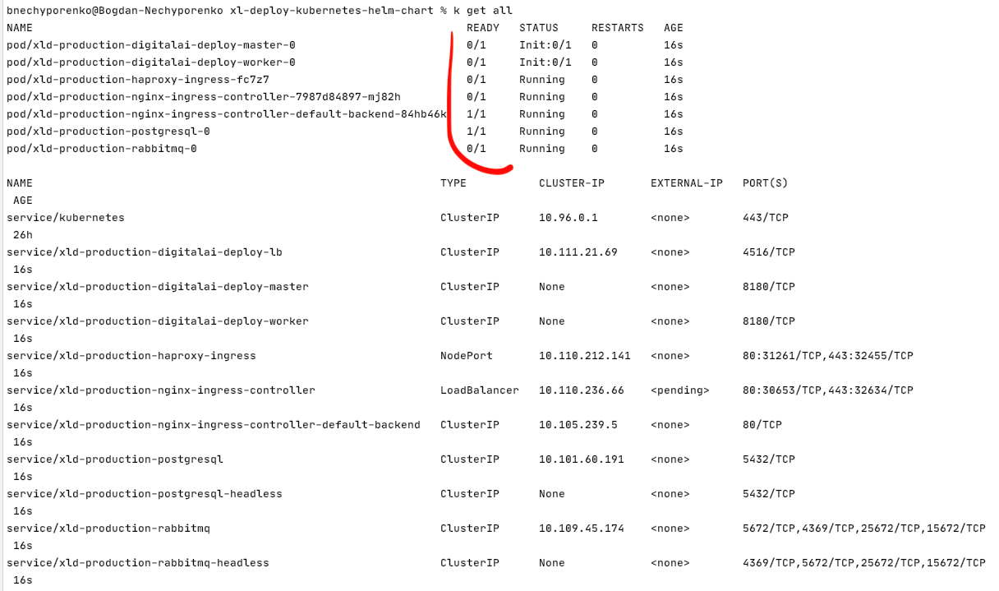

# Development

:::caution
This is internal documentation. This document can be used only if it was recommended by the Support Team.
:::

:::caution
From 10.2 version helm chart is not used directly. Use operator based installation instead.
:::

Let's have a look here about the easiest way to setup the cluster for a development on a local computer.

1. Copy `values-haproxy.yaml` or `values-nginx.yaml` and rename it as `values.yaml` 
2. Replace all usages in `values.yaml` of `storageClass: "-"` to `storageClass: "standard"`. This way we will use
local file system as a dynamic storage class with no need of configuring NFS server.
3. Define 

```yaml title=values.yaml
AdminPassword:
  admin

xldLicense:
    # Convert xl-deploy.lic files content to base64
```

4. Comment out `RepositoryKeystore` and `KeystorePassphrase`

5. Turn of persistence with

```yaml
Persistence:
  Enabled: false
``` 

6. You can also change `XldMasterCount` and `XldWorkerCount` to 1 or 2. Depends on your computer capacity.
Same for RabbitMq. On Dev environment, you can just use 1 replica.

Once all of that is done you are ready to run it from the root of the project:
`helm install xld-production .`
Only make sure, that you installed kubernetes (currently it works on 1.17-1.20) and helm. 

When you want to clean it up: `helm delete xld-production` plus you have to remove your `pvc`, like
`kubectl delete pvc data-xld-production-postgresql-0 data-xld-production-rabbitmq-0`. <br/>
You might have slightly different names, if so, first list `pvcs` to check what you have with `kubectl get pvc`.

## Troubleshooting

Most of the cases what you have to know to troubleshoot your cluster locally:

1) Check logs of the pod `kubectl logs POD_NAME -f`

2) Check the state of pod/service/etc by `kubectl describe POD_NAME|SERVICE_NAME|ETC`. 

To find all what you have on your system up and running `kubectl get all` 
. First thing you need to pay your attention to is the readiness of the Pods.
For ingress that you have external IP address to be able connect to UI from your browser. 
